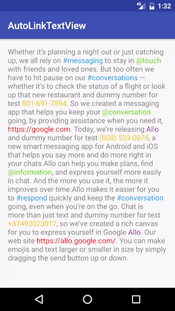
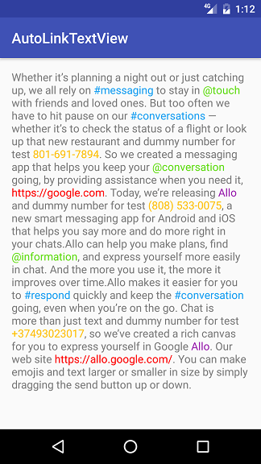
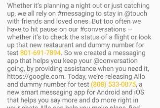
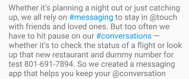
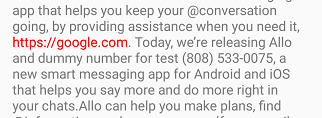
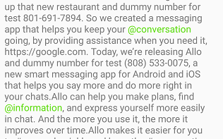
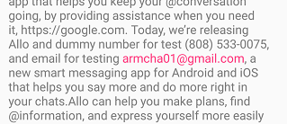
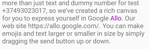
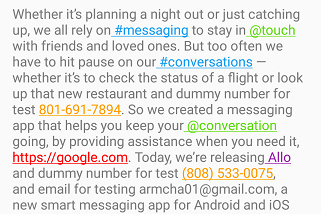

# ~~AutoLinkTextView~~
[](https://android-arsenal.com/details/1/4419)

## Deprecated
[22]: https://github.com/armcha/AutoLinkTextViewV2
### Please use the new version of [AutoLinkTextView][22]

AutoLinkTextView is TextView that supports Hashtags (#), Mentions (@) , URLs (http://),
Phone and Email automatically detecting and ability to handle clicks.



The current minSDK version is API level 14 Android 4.0 (ICE CREAM SANDWICH).

## Download sample [apk][77]
[77]: https://github.com/armcha/AutoLinkTextView/raw/master/screens/AutoLinkTextView.apk

## Features

* Default support for **Hashtag, Mention, Link, Phone number and Email**
* Support for **custom types** via regex
* Ability to set text color
* Ability to set pressed state color
* Ability to make specific modes **bold**


-----------------------

## Download

Gradle:
```groovy
compile 'com.github.armcha:AutoLinkTextView:0.3.0'
```

## Setup and usage

Add AutoLinkTextView to your layout
```xml
    <com.luseen.autolinklibrary.AutoLinkTextView
         android:id="@+id/active"
         android:layout_width="wrap_content"
         android:layout_height="wrap_content" />
```

```java
AutoLinkTextView autoLinkTextView = (AutoLinkTextView) findViewById(R.id.active);
```

Set up mode or modes
```java
autoLinkTextView.addAutoLinkMode(
                AutoLinkMode.MODE_PHONE);
```

Set text to AutoLinkTextView
```java
autoLinkTextView.setAutoLinkText(getString(R.string.long_text));
```

Set AutoLinkTextView click listener
```java
autoLinkTextView.setAutoLinkOnClickListener(new AutoLinkOnClickListener() {
            @Override
            public void onAutoLinkTextClick(AutoLinkMode autoLinkMode, String matchedText) {

            }
        });
```

Customizing
---------

AutoLinkModes

-------------------------
#### AutoLinkMode.MODE_PHONE


-------------------------
#### AutoLinkMode.MODE_HASHTAG


-------------------------
#### AutoLinkMode.MODE_URL


-------------------------
#### AutoLinkMode.MODE_MENTION


-------------------------
#### AutoLinkMode.MODE_EMAIL


-------------------------
#### AutoLinkMode.MODE_CUSTOM



if you use custom mode, you should also add custom regex,

```java
autoLinkTextView.setCustomRegex("\\sAllo\\b");
```
Note:Otherwise ```MODE_CUSTOM``` will return ```MODE_URL```
-------------------------
You can also use multiple types
```java
autoLinkTextView.addAutoLinkMode(
                AutoLinkMode.MODE_HASHTAG,
                AutoLinkMode.MODE_PHONE,
                AutoLinkMode.MODE_URL,
                AutoLinkMode.MODE_MENTION,
                AutoLinkMode.MODE_CUSTOM);
```

-------------------------
You can also change text color for autoLink mode
```java
autoLinkTextView.setHashtagModeColor(ContextCompat.getColor(this, R.color.yourColor));
autoLinkTextView.setPhoneModeColor(ContextCompat.getColor(this, R.color.yourColor));
autoLinkTextView.setCustomModeColor(ContextCompat.getColor(this, R.color.yourColor));
autoLinkTextView.setUrlModeColor(ContextCompat.getColor(this, R.color.yourColor));
autoLinkTextView.setMentionModeColor(ContextCompat.getColor(this, R.color.yourColor));
autoLinkTextView.setEmailModeColor(ContextCompat.getColor(this, R.color.yourColor));
```
-------------------------
And also autoLink text pressed state color
```java
autoLinkTextView.setSelectedStateColor(ContextCompat.getColor(this, R.color.yourColor));
```
-------------------------

Set modes that should be bold

```java
autoLinkTextView.setBoldAutoLinkModes(
  AutoLinkMode.MODE_HASHTAG,
  AutoLinkMode.MODE_PHONE,
  AutoLinkMode.MODE_URL,
  AutoLinkMode.MODE_EMAIL,
  AutoLinkMode.MODE_MENTION
);
```

-------------------------
#### Enable under line

```java
autoLinkTextView.enableUnderLine();
```


-------------------------

### Contact :book:

:arrow_forward:  **Email**: chatikyana@gmail.com

:arrow_forward:  **Medium**: https://medium.com/@chatikyan

:arrow_forward:  **Twitter**: https://twitter.com/ArmanChatikyan

:arrow_forward:  **Google+**: https://plus.google.com/+ArmanChatikyan

:arrow_forward:  **Website**: https://armcha.github.io/

License
--------


      Auto Link TextView library for Android
      Copyright (c) 2018 Arman Chatikyan (https://github.com/armcha/AutoLinkTextView).

      Licensed under the Apache License, Version 2.0 (the "License");
      you may not use this file except in compliance with the License.
      You may obtain a copy of the License at

         http://www.apache.org/licenses/LICENSE-2.0

      Unless required by applicable law or agreed to in writing, software
      distributed under the License is distributed on an "AS IS" BASIS,
      WITHOUT WARRANTIES OR CONDITIONS OF ANY KIND, either express or implied.
      See the License for the specific language governing permissions and
      limitations under the License.


